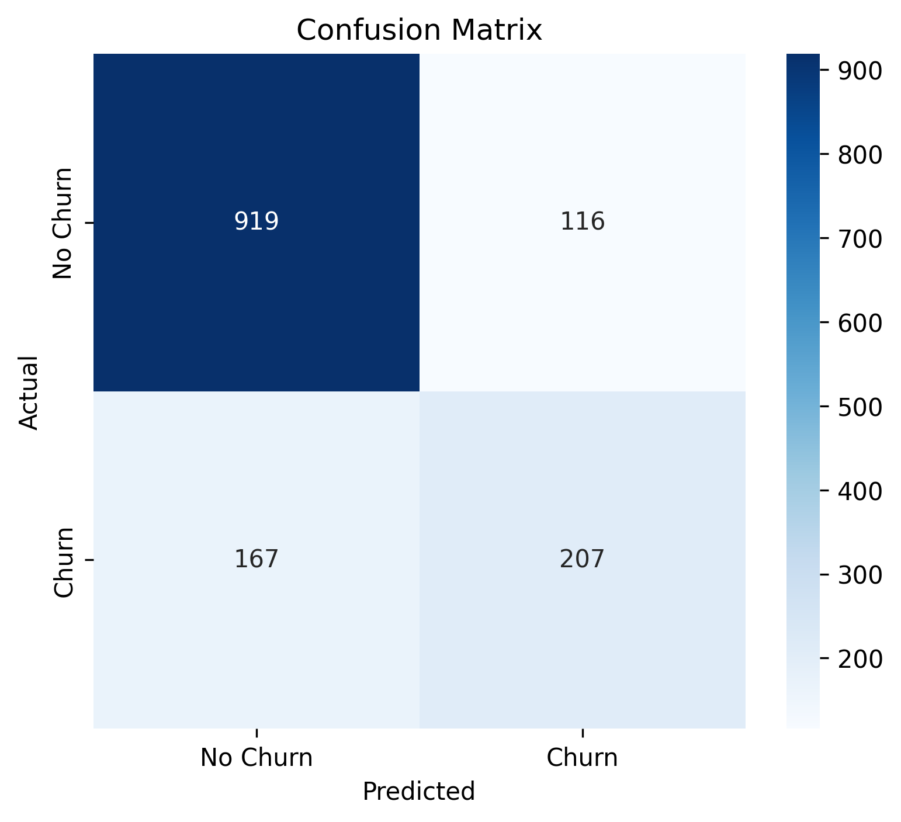

# Customer Churn Prediction using Logistic Regression

## 📌 Objective

The objective of this project is to develop a Logistic Regression model that predicts whether a customer is likely to churn based on demographic information and telecom service usage.

---

## 📊 Dataset

**Dataset Name:** Telco Customer Churn Dataset

Kaggle Link:
https://www.kaggle.com/datasets/blastchar/telco-customer-churn

---

## 📚 Libraries Used

- pandas
- numpy
- matplotlib
- seaborn
- scikit-learn

---

## 🛠️ Methodology

1. Loaded the dataset using Pandas.
2. Explored the dataset using `head()`, `info()`, and `describe()`.
3. Identified numerical and categorical features.
4. Handled missing values in the `TotalCharges` column.
5. Converted categorical variables into numerical values using Label Encoding.
6. Split the dataset into training (80%) and testing (20%).
7. Built a Logistic Regression model.
8. Evaluated the model using Accuracy, Precision, Recall, F1-score, and Confusion Matrix.

---

## 📈 Results

The Logistic Regression model achieved good performance in predicting customer churn.

Evaluation Metrics:

- Accuracy
- Precision
- Recall
- F1-score

A confusion matrix was also generated to visualize the prediction performance.

---

## ✅ Conclusion

The Logistic Regression model successfully predicted customer churn with good accuracy. Features such as tenure, contract type, internet services, and monthly charges significantly influenced customer churn. Although Logistic Regression is simple and interpretable, more advanced machine learning models can potentially improve prediction accuracy.

---

## 📷 Output

### Confusion Matrix

